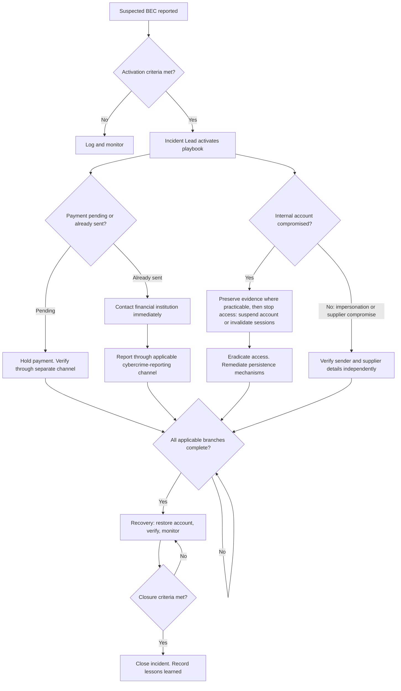

# Business Email Compromise Response Playbook Template

> **Status:** Public template — requires organisational customisation 
> **Document version:** 1.0  
> **Generated:** 28 July 2026 
> **Generated with:** [Skriv](https://github.com/torin-cyber-group/skriv)  
> **Validation:** Pass with warnings 
> **Licence:** [CC BY 4.0](https://creativecommons.org/licenses/by/4.0/)

## Document control

| Field | Value |
|---|---|
| Template version | 1.0 |
| Template status | Public template |
| Document owner | {{DOCUMENT_OWNER}} |
| Approving authority | {{APPROVING_AUTHORITY}} |
| Organisational version | {{ORGANISATIONAL_VERSION}} |
| Approval date | {{APPROVAL_DATE}} |
| Review date | {{REVIEW_DATE}} |
| Classification | {{CLASSIFICATION}} |

## How to customise this template

Before operational use, the adopting organisation must:

- assign every documented organisation field;
- confirm incident roles, contacts, decision authorities and escalation thresholds;
- align actions with current email, identity, finance, evidence and communications procedures;
- verify time-sensitive external guidance, including government reporting pages and vendor documentation, against current primary sources before publication or operational use;
- obtain qualified legal or privacy review for applicable jurisdictions;
- test the playbook, approve the organisational version and set a maintenance schedule; and
- verify every reference and platform-dependent action remains current.

## Purpose

Business email compromise (BEC) is a scam. An attacker uses email to impersonate a business or its staff, or takes control of a real account. The goal is to trick someone into making a fraudulent payment or disclosing sensitive information. This can happen through a compromised account, a lookalike domain (a domain designed to look like a genuine one) or a spoofed sender address.

BEC usually relies on deception and social engineering, tricking a person into acting rather than tricking a system. It does not need a malicious attachment or malware, although credential phishing or account compromise can happen first.

One BEC scenario is payment or invoice redirection, where an attacker impersonates or intercepts a payment request and substitutes their own bank account details.

This playbook helps your team respond to BEC. It covers activation, containment, investigation, recovery of affected accounts and payments, and lessons learned.

## Scope

This template covers business email compromise, including:

- account compromise used to send fraudulent messages;
- impersonation using a lookalike domain or spoofed sender address, without an internal account being compromised; and
- payment redirection that starts with a compromised supplier or vendor account, where the compromise sits outside your organisation's own environment.

This template does not cover:

- step-by-step commands for every email or identity platform. Detailed examples use Microsoft 365 and Google Workspace only, as illustrative platforms. The Email or Identity Administrator must substitute the organisation's actual platform procedures;
- legal advice. Legal or Privacy assessment is required for jurisdiction, sector, contract and insurance questions; and
- organisation-specific approval rules, activation thresholds and escalation authorities, which the adopting organisation must define during customisation.

## Immediate actions

Complete these actions as soon as BEC is suspected.

- Determine whether the suspicious payment is pending or has already been sent.
- If a payment has not been sent, hold it. Verify the request with the requesting party through a contact channel you already hold or independently obtain, not through details in the request itself.
- If a transfer has already been sent, contact the financial institution immediately to ask about recall, reversal, hold or freeze options. Remedies, terminology and required documentation vary by institution and jurisdiction, and recovery is not guaranteed.
- Gather the available transfer details and related correspondence to support financial intervention and reporting.
- Identify whether the incident involves a compromised internal account, external impersonation only, or a compromised supplier or vendor account.
- If an internal account appears compromised, ask the Email or Identity Administrator to suspend the account or invalidate its active sessions immediately. This stops continuing unauthorised access. Capture available evidence first if this will not delay containment; otherwise, contain first and preserve what evidence remains.
- Report the incident through the cybercrime-reporting channel that currently applies in your jurisdiction. See Jurisdiction-specific considerations for illustrative examples, and confirm the applicable channel before relying on it.

## Roles and responsibilities

| Role | Generic responsibility | Organisation assignment |
|---|---|---|
| Incident Lead | Coordinate the response, decisions and closure. | {{INCIDENT_LEAD}} |
| Finance or Treasury | Coordinate payment intervention and financial verification. | {{FINANCE_CONTACT}} |
| Email or Identity Administrator | Investigate and secure affected email or identity services. | {{EMAIL_IDENTITY_ADMIN}} |
| Legal or Privacy | Assess legal, privacy, contractual and reporting requirements. | {{LEGAL_PRIVACY_CONTACT}} |
| Communications | Coordinate approved internal and external communications. | {{COMMUNICATIONS_CONTACT}} |
| Executive Sponsor | Provide accountable executive decisions and support. | {{EXECUTIVE_SPONSOR}} |
| Evidence Custodian | Oversee evidence handling where required. | {{EVIDENCE_CUSTODIAN}} |

## Response flowchart

Preserve evidence before remediation where practicable. If preserving evidence would delay stopping active unauthorised access, stop the access first and preserve what evidence remains afterwards. Move to recovery only once every applicable branch for this incident — financial, reporting, investigation, containment and eradication — is complete.

## 1. Preparation

Preparation gives the team the people, access, records and procedures needed to respond.

- Configure multi-factor authentication (MFA) on email and identity accounts. Government guidance identifies MFA as reducing the risk of email-account compromise. Select and configure an MFA method appropriate to your identity platform.
- Define and test a payment-verification procedure that confirms bank-detail changes through a channel separate from the request itself.
- Confirm and test your financial institution's current fraud-reporting and payment recall or reversal procedure, including required authorisations and documentation, before an incident occurs.
- Assign incident-response roles, contacts, capabilities and procedures before an incident occurs, consistent with the roles table above.
- Confirm which log sources are enabled on your email and identity platforms, who can access them, and how long records are retained. Retention and available features depend on the product, edition, privileges and configuration.
- Train staff to recognise and promptly report suspicious indicators, such as unusual urgency or sender-address inconsistencies. Define the organisation's reporting channel and approved examples.
- Feed confirmed lessons from previous incidents back into these preparation controls.

## 2. Identification

Identification confirms whether to activate the playbook and sets the initial scope.

### Activation criteria

Treat any of the following as a possible activation trigger:

- suspected or confirmed unauthorised access to an email account. For Microsoft 365, indicators can include a new forwarding rule, a sending restriction, an unexpected directory-contact change, or a password change or lockout. Confirm the equivalent indicators for your own platform;
- a payment or bank-detail change request from a compromised or lookalike sender address;
- notification from a supplier, customer or bank that a payment request looks fraudulent or was redirected;
- a staff report of unusual urgency or sender-address inconsistency in a request involving payment or sensitive information; or
- evidence that a compromised mailbox sent further phishing or fraud messages.

Map these criteria to your own severity model and set the incident threshold and escalation path before use.

### Immediate triage questions

- Determine whether the suspicious payment is pending or already sent.
- Determine whether an internal account appears compromised, or whether this is impersonation only — for example, through a lookalike domain.
- Consider whether the source of compromise could be a supplier or vendor account rather than an internal one.
- Identify affected accounts, mailboxes, messages, transactions and systems.
- For Microsoft 365, check for signs such as new forwarding rules, sending restrictions or unexpected directory changes.
- For Google Workspace, check sign-in and account activity logs.

### Evidence to preserve

Preserve originals wherever possible. Record who collected each item, when it was collected and where it came from.

Message trace and audit log records vary by platform. Check your provider's current documentation to confirm what each type of record shows and how to access it.

- Preserve Sent Items, Deleted Items and other mailbox folders that may hold messages sent by the attacker.
- Capture sign-in logs, audit logs and message trace covering a period before the known suspicious activity, where the platform provides them.
- Capture the available transfer details and related correspondence needed for financial intervention and reporting.
- Capture records before remediation changes the mailbox state, where practicable. If preserving evidence would delay stopping active unauthorised access, stop the access first and preserve what evidence remains.
- Confirm your enabled log sources, retention settings and export access before relying on them. Confirm this during preparation, not during an incident.

### Investigation

The investigation should establish when access occurred, what was accessed and what messages were sent. Keep established facts, actions taken and platform limitations clearly separate.

- For Microsoft 365, use sign-in logs, audit logs and message trace for this review.
- For Google Workspace, use the platform's administrative investigation tools and log events for equivalent review.
- For Microsoft 365, do not apply filters so narrow that unexpected attacker activity is excluded from the initial review. Confirm equivalent guidance for other platforms.
- Record in the investigation findings where logs are unavailable or expired, and state how this limits your conclusions.
- Route any indication of unauthorised access to, or disclosure of, personal information to the Legal or Privacy contact. Do this without waiting for the full technical investigation to conclude.

## 3. Containment

Containment stops or limits harm while the team investigates.

### Financial containment

- If a payment has not been sent, hold it until the request is verified through a separately sourced contact channel.
- If a transfer has already been sent, contact the financial institution immediately. Ask about recall, reversal, hold or freeze options, and what records or documentation it requires.
- Where a supplier or vendor account may be compromised, verify current payment details directly with the supplier through a known channel before paying.
- Report the incident through the cybercrime-reporting channel that currently applies in your jurisdiction. See Jurisdiction-specific considerations for illustrative examples, and confirm the applicable channel and procedure before relying on it. In the United States, report promptly. Fast reporting supports the Recovery Asset Team process, run by the Federal Bureau of Investigation (FBI), for eligible fraudulent-transfer cases. Confirm current eligibility, process and timing directly with the FBI's Internet Crime Complaint Center (IC3).

### Account or mailbox containment

- Suspend the account or invalidate its active sessions and sign-in tokens immediately, to stop continuing unauthorised access. Sign-in tokens are the records that keep a user signed in without re-entering credentials. Do not rely on a password reset alone.
- Then check and remove other ways an attacker could keep access:
  - mailbox forwarding and inbox rules;
  - registered MFA methods;
  - permissions granted to other apps (application consents); and
  - any administrator roles assigned to the account.
- Preserve relevant evidence before making changes, where practicable. If this would delay stopping active access, stop the access first and preserve what evidence remains.
- Review Sent Items and Deleted Items for further fraudulent messages sent from the compromised mailbox.
- Perform only actions supported by your platform and approved administration procedures. This checklist is primarily documented for Microsoft 365. Substitute your organisation's approved runbook for other platforms.

## 4. Eradication and remediation

Eradication removes confirmed malicious access or changes. Remediation addresses the cause and reduces the chance of recurrence.

- Confirm the account or mailbox containment actions above are complete before treating the account as eradicated.
- Confirm removal of confirmed malicious access, including sessions, forwarding rules, MFA registrations and application consents.
- For Microsoft 365, do not restore the account until credentials have been reset. Also review and remediate MFA registrations, application consents and other identified access mechanisms first.
- Consider strengthening MFA configuration where account takeover contributed to the incident. Verify current vendor guidance and your platform-specific MFA requirements before relying on any specific method.

## 5. Recovery

Recovery restores trusted operation and checks that the incident does not recur.

- Deliver replacement credentials to the affected user through a verified channel separate from the affected mailbox.
- After restoring access, monitor the account for renewed or continuing suspicious activity. Google Workspace provides alerts and activity logs for this. Confirm the equivalent monitoring method if you use a different platform. Define monitoring ownership and duration for this incident.
- Warn contacts who received fraudulent messages from the compromised mailbox. The Incident Lead and Communications role must coordinate recipients, timing, wording and approved sending channels before this goes out.

### Communications and notifications

- Distinguish internal escalation, vendor engagement, contractual notification and regulatory or statutory notification. These are separate tracks with separate owners.
- Coordinate broad external communications with account containment and any active financial-institution or law-enforcement engagement, unless the incident circumstances require an immediate warning or notification.
- Route suspected exposure of personal information to Legal or Privacy for assessment. Do not wait for the investigation to conclude.
- Legal or Privacy must assess whether a statutory or contractual notification obligation applies. Do not assume notification is required merely because email was involved.
- See Jurisdiction-specific considerations for examples. Treat these as illustrative, not as default obligations for your organisation.

### Closure criteria

Close the incident only when the following are confirmed:

- the compromise pathway is contained;
- the affected account, mailbox or payment has been identified and scoped as far as reasonably possible;
- evidence has been preserved to the extent available;
- credentials, MFA registrations, forwarding rules, application consents and other identified ways an attacker could keep access (persistence mechanisms) have been reviewed and remediated;
- replacement credentials were delivered through a verified, separate channel;
- monitoring for renewed suspicious activity has run for the defined period, using a method appropriate to your platform;
- required legal, contractual and insurance notification assessments have been completed by Legal or Privacy; and
- unresolved limitations and residual risk have been documented and accepted by the Executive Sponsor or the accountable role.

Confirm your organisation's closure authority and any additional criteria before use.

## 6. Lessons learned

Review the response and assign improvements with owners and due dates.

- Review the response against this playbook and identify what worked and what did not.
- Consider improvements to MFA, payment-detail verification and staff awareness where the review identifies weaknesses in these areas.
- Assign each improvement an owner and a due date.
- Feed confirmed improvements back into the Preparation section.

## Action and decision log

| Date/time | Action or decision | Owner | Outcome or reference |
|---|---|---|---|
|  |  |  |  |

## Jurisdiction-specific considerations

Use the examples below only as a starting point. Confirm every applicable jurisdiction, sector, contract and insurance obligation through qualified legal or privacy review before operational use.

### Australia

- An entity covered by the Privacy Act 1988 (Cth) must assess certain incidents under the Notifiable Data Breaches (NDB) scheme. This applies where the incident involves unauthorised access to, or disclosure of, personal information. The entity must consider whether serious harm is likely and whether notification is required.
- Confirm whether your organisation is a covered entity, including any small-business coverage question and applicable exceptions, with your Legal or Privacy contact. Do not assume coverage or exemption without current legal confirmation.
- Report incidents through ReportCyber (cyber.gov.au), the Australian Government's cybercrime-reporting channel, or your current applicable channel. Confirm eligibility and process directly before relying on it.
- Confirm the legal thresholds that trigger a notification requirement (statutory thresholds), exceptions and current legislation with qualified legal advice before relying on this section.

### United States

- IC3 is a cybercrime-reporting and financial-recovery-assistance channel run by the FBI. It is not evidence of a universal statutory breach-notification requirement.
- Prompt reporting matters to the Recovery Asset Team process for eligible fraudulent-transfer cases. Confirm current eligibility, process and timing directly with IC3 before relying on any specific reporting window.
- Confirm applicable United States federal, state and sector-specific notification law with qualified legal advice. This template does not state a United States statutory notification obligation.

## References

- Australian Signals Directorate's Australian Cyber Security Centre (ASD's ACSC), *Report and recover from business email compromise*. https://www.cyber.gov.au/report-and-recover/recover-from/business-email-compromise (accessed 28 July 2026). Confirm current content directly before relying on this source.
- ASD's ACSC, *Preventing business email compromise*. https://www.cyber.gov.au/protect-yourself/securing-your-email/email-security/preventing-business-email-compromise (accessed 28 July 2026). Confirm current content directly before relying on this source.
- Federal Bureau of Investigation, Internet Crime Complaint Center (IC3), *Business Email Compromise*. https://www.ic3.gov/CrimeInfo/BEC (accessed 28 July 2026).
- Federal Bureau of Investigation, IC3, *2024 Internet Crime Report*. https://www.ic3.gov/AnnualReport/Reports/2024_IC3Report.pdf (accessed 28 July 2026). Confirm current content directly before relying on this source.
- National Institute of Standards and Technology, *SP 800-61 Revision 3: Incident Response Recommendations and Considerations for Cybersecurity Risk Management*. https://csrc.nist.gov/pubs/sp/800/61/r3/final (accessed 28 July 2026).
- Microsoft, *Respond to a compromised email account in Microsoft 365*. https://learn.microsoft.com/en-us/defender-office-365/responding-to-a-compromised-email-account (accessed 28 July 2026).
- Google, *Identify and secure compromised accounts*, Google Workspace Admin Help. https://knowledge.workspace.google.com/admin/support/troubleshooting/identify-and-secure-compromised-accounts (accessed 28 July 2026).
- Office of the Australian Information Commissioner (OAIC), *Part 4: Notifiable Data Breach (NDB) Scheme*. https://www.oaic.gov.au/privacy/privacy-guidance-for-organisations-and-government-agencies/preventing-preparing-for-and-responding-to-data-breaches/data-breach-preparation-and-response/part-4-notifiable-data-breach-ndb-scheme (accessed 28 July 2026).
- Australian Competition and Consumer Commission, Scamwatch, *Payment redirection scams cost Australian businesses $14 million*. https://www.scamwatch.gov.au/about-us/news-and-alerts/payment-redirection-scams-cost-australian-businesses-14-million (accessed 28 July 2026).
- Cybersecurity and Infrastructure Security Agency (CISA), *Avoiding Social Engineering and Phishing Attacks* (ST04-014). https://www.cisa.gov/uscert/ncas/tips/ST04-014 (accessed 28 July 2026).
